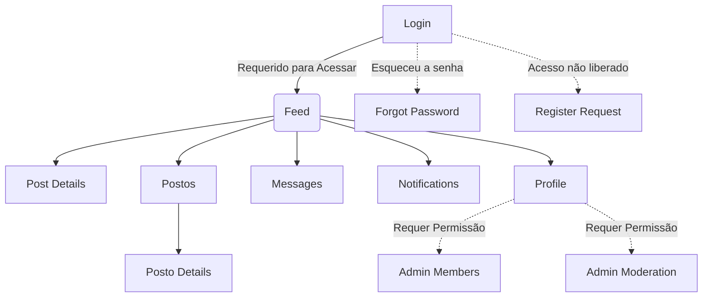

# Estrutura de Páginas e Funcionalidades (Social-ASOF)

Este documento descreve as páginas da aplicação, suas principais funcionalidades (features) e os requisitos que definem quando cada aspecto pode ser considerado implementado e totalmente funcional.

## Arquitetura de Navegação

## 1. Módulo de Autenticação e Acesso

### Login (`/src/pages/Login.tsx`)
- **Função:** Porta de entrada para usuários já registrados com contas ativas e aprovadas e fluxo de acesso restrito.
- **Features Principais:** Autenticação via Email/Senha (Firebase Auth).
- **Requisitos de Funcionalidade:**
  - Deve validar adequadamente credenciais corretas e redirecionar para o `Feed`.
  - Deve exibir mensagens de erro amigáveis para credenciais inválidas ou e-mails não validados.
  - A proteção de rotas deve ocultar completamente o shell e painéis de controle quando o usuário não estiver logado.

### Solicitação de Acesso (`/src/pages/RegisterRequest.tsx`)
- **Função:** Permite que novos usuários solicitem participação e acesso à rede privada.
- **Features Principais:** Formulário com identificador corporativo (ex: CPF, matrícula) e justificativa.
- **Requisitos de Funcionalidade:**
  - Validar campos obrigatórios antes da submissão.
  - Registrar a requisição na coleção do Firestore com status de `PENDING` ao concluir o processo.
  - Redirecionar o usuário para uma tela final de sucesso sem conceder entrada ao sistema até liberação de um administrador.

### Recuperação de Senha (`/src/pages/ForgotPassword.tsx`)
- **Função:** Solicitação de redefinição de segurança.
- **Features Principais:** Firebase Password Reset.
- **Requisitos de Funcionalidade:**
  - Validar email do usuário.
  - Confirmar sucesso ao disparar o email padrão via Firebase.

---

## 2. Módulo de Interação de Conteúdo

### Feed (`/src/pages/Feed.tsx`)
- **Função:** Dashboard central com fluxo de atualizações e publicações da comunidade, sendo a rota principal após o acesso.
- **Features Principais:**
  - Listagem de Postagens e Renderização em Cards.
  - Editor de nova postagem.
  - Filtros Categóricos.
  - Paginação Nativa (Scroll Infinito).
  - Componentes transitórios via Skeleton Loading para UX fluida.
- **Requisitos de Funcionalidade:**
  - Posts exibidos ordenadamente (do mais novo ao mais antigo).
  - O sistema de Paginação Automática via *Intersection Observer* deve carregar limitados blocos, adicionando novos apenas no limite da tela (`hasMore` e estado `limitCount` corretos).
  - O usuário deve conseguir categorizar, favoritar (bookmark) e procurar termos por texto.

### Detalhes do Post (`/src/pages/PostDetails.tsx`)
- **Função:** Árvore expandida de uma postagem específica para leitura e moderação.
- **Features Principais:** Conteúdo do tópico e fluxo de Comentários Aninhados.
- **Requisitos de Funcionalidade:**
  - Deve renderizar e decodificar perfeitamente o campo HTML interno ou Markdown do post.
  - Exibição de Respostas (Comments) via listener (`onSnapshot`) em tempo real.
  - Permite aos criadores ou perfis de administrador excluírem de forma segura os dados do post e subtópicos.

---

## 3. Módulo de Cadastros e Locais

### Diretório de Postos / Locais (`/src/pages/Postos.tsx`)
- **Função:** Área destinada à exploração das Unidades de Interesse (batalhões, postos, hospitais, clínicas).
- **Features Principais:** Listagem geral categorizada.
- **Requisitos de Funcionalidade:**
  - Busca local integrada sem quebras.
  - Carregamento inicial em bloco contendo a relação de itens na coleção do banco.

### Detalhes do Posto (`/src/pages/PostoDetails.tsx`)
- **Função:** Inspeção minuciosa sobre a estrutura, detalhes e opinião em massa sobre cada posto.
- **Features Principais:** Informações contextuais (Campos) e Avaliações Dinâmicas (Reviews).
- **Requisitos de Funcionalidade:**
  - Mostrar uma composição de nota agregada válida, calculada na leitura.
  - Permitir a criação de no máximo um feedback/análise formatada por ID de usuário (Impedir múltiplos votos sob o mesmo UID).
  - Fluxo protegido de "Denúncia/Report".

---

## 4. Módulo de Social, Identidade e Comunicação

### Perfil do Usuário (`/src/pages/Profile.tsx`)
- **Função:** Gestor de identidade na aplicação. Onde o usuário valida sua imagem, atribuições e interações históricas.
- **Features Principais:** Edição do campo Bio/Avatar, Histórico "Meus Posts", e Central de Salvos (Bookmarks).
- **Requisitos de Funcionalidade:**
  - Renderizar Posts Salvos apenas caso o usuário visualizando seja o próprio dono do perfil (IsOwner).
  - Exigir re-autenticação em fluxos se edição de e-mail sensível for introduzida futuramente.
  - As atualizações (como a Bio) devem ser guardadas com `updateDoc` e refletir em tempo real.

### Mensagens Diretas (`/src/pages/Messages.tsx`)
- **Função:** Comunicação point-to-point (P2P) entre membros da plataforma.
- **Features Principais:** Painel de chat (Histórico lateral) e Chatbox com timestamps contínuos.
- **Requisitos de Funcionalidade:**
  - Uso rígido de observadores (Sockets / Snapshots Firebase) sem expiração que garantam envio bidirecional com fluidez.
  - Restrições de Firestore Security Rules válidas para evitar espiamentos: `request.auth.uid in resource.data.participants`.

### Notificações (`/src/pages/Notifications.tsx`)
- **Função:** Bandeja de logs ativados por gatilhos.
- **Features Principais:** Badges e Read/Unread State.
- **Requisitos de Funcionalidade:**
  - Apresentar badge vermelha não ignorável numéricos via Context na Barra Superior.
  - Marcação de leitura pontual, removendo estado ativo de alerta ao fechar link.

---

## 5. Módulo Administrativo e Contramedidas 

### Membros - Painel ADM (`/src/pages/AdminMembers.tsx`)
- **Função:** Autoridade da centralização onde o controle de acesso ao aplicativo restrito é feito ativamente.
- **Features Principais:** Tabela/Lista interativa e Avaliadora de Perfis Solicitantes (`memberRequests`).
- **Requisitos de Funcionalidade:**
  - Disponibilidade total garantida pelas Regras Firebase: somentes uids marcados como "isAdmin" no documento têm permissão de leitura.
  - Controles lógicos para APROVAR (criando auth profile) e REPROVAR, processando do banco permanentemente.

### Moderação Central (`/src/pages/AdminModeration.tsx`)
- **Função:** Fiscalização sanitária em conteúdo do fórum e controle sobre comportamentos destrutivos ou anti-éticos.
- **Features Principais:** Triage de "Reports" via sub-categorias.
- **Requisitos de Funcionalidade:**
  - Deve receber todas as referências apontadas contra postagens via feed ("Marcar Tópico").
  - Painel com capacidade de marcar reportings como "RESOLVIDO", e excluir conteúdo base acoplado.
