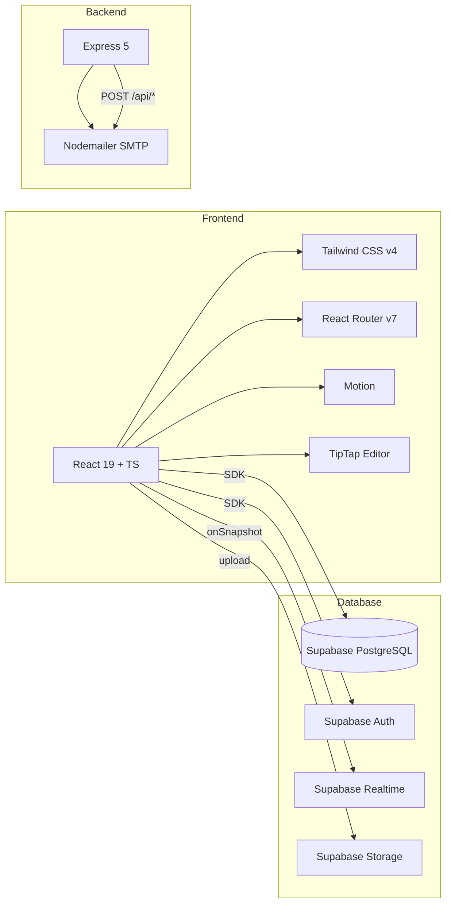
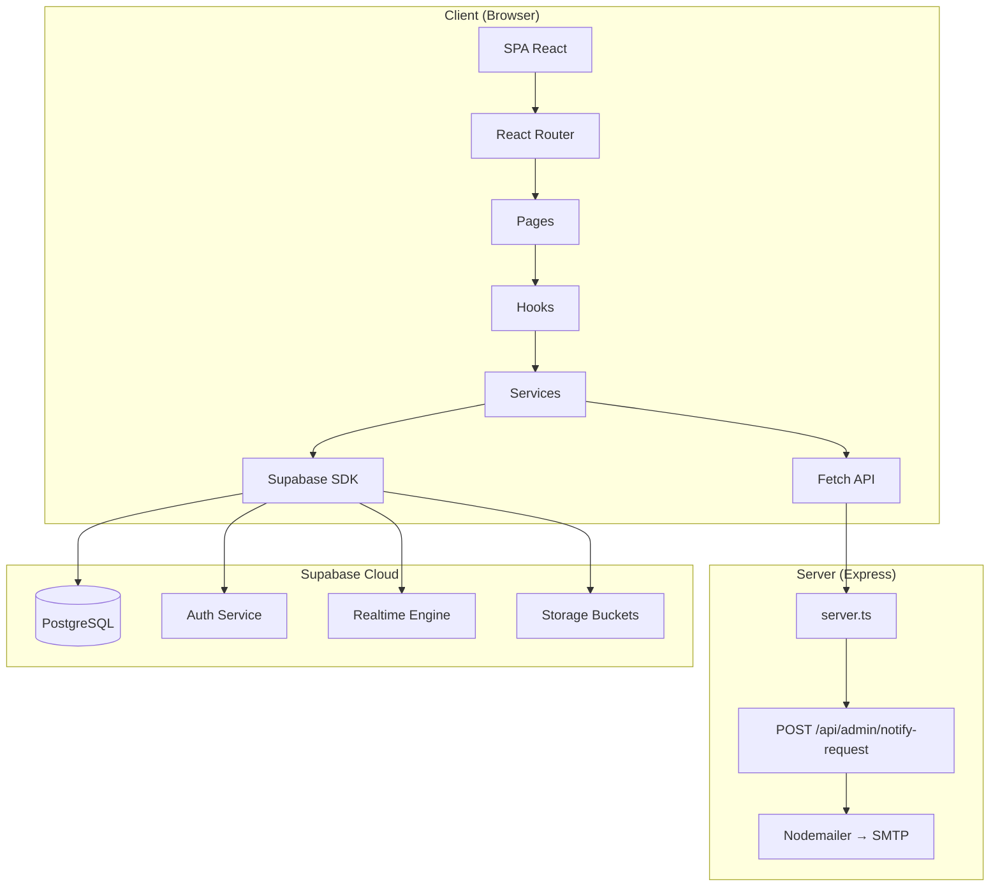
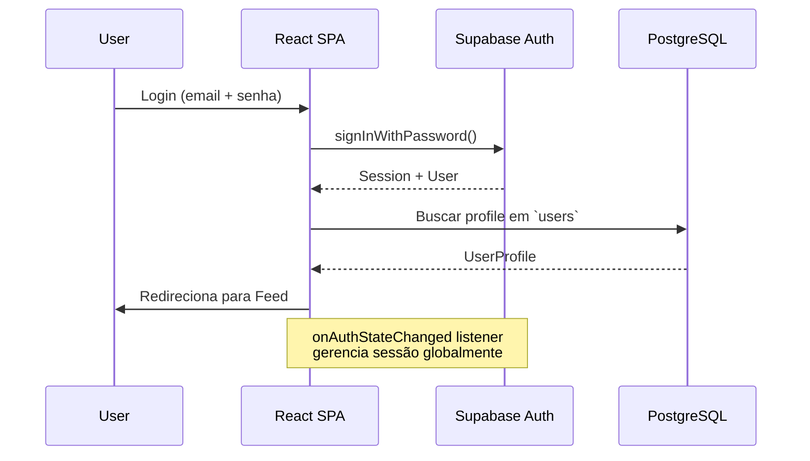
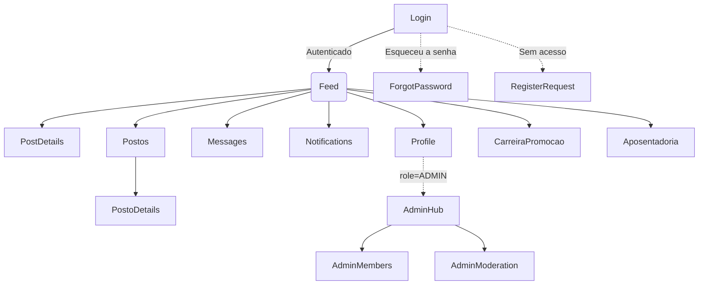
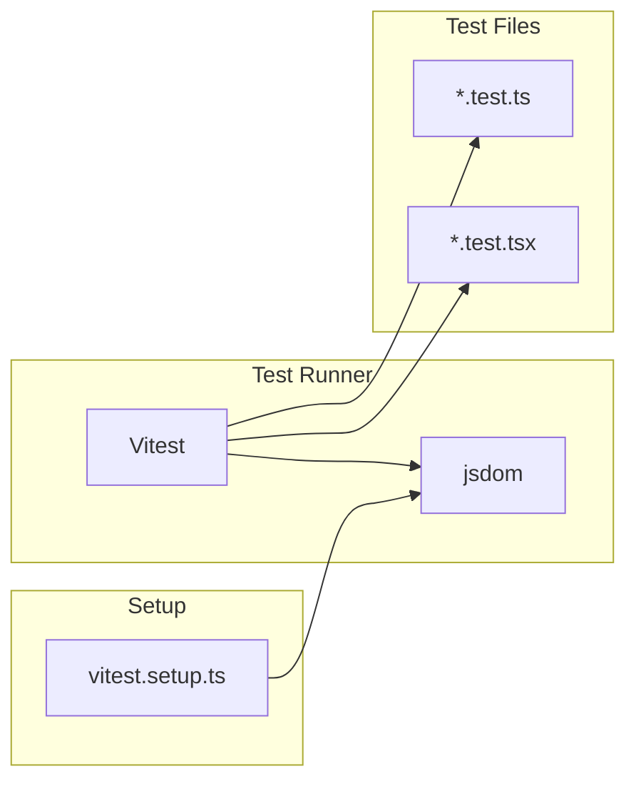

# Social-ASOF


**Comunidade exclusiva para associados da ASOF.** Conecte-se, compartilhe e colabore em um ambiente seguro e institucional — feito por e para membros da Associação dos Oficiais de Chancelaria.

---

## Visão Geral

O Social-ASOF é uma rede social institucional privada que oferece um espaço estruturado para que membros ativos e aposentados da ASOF possam:

- 📰 Acompanhar o **feed** de publicações da comunidade
- 💬 Participar de **discussões** categorizadas por posto, carreira, vida no exterior e aposentadoria
- ✉️ Enviar **mensagens diretas** entre membros
- 📍 Explorar **postos diplomáticos** com avaliações e reviews
- 🔔 Receber **notificações** de menções, respostas e atualizações
- 👤 Gerenciar **perfil**, avatar, contatos e interesses
- 🛡️ **Moderar** conteúdo (admin) e gerenciar solicitações de acesso

A plataforma atende dois perfis predominantes: **aposentados (65–85 anos)** e **servidores ativos (50–65 anos)**, com foco em acessibilidade, tipografia legível, contraste elevado e navegação simples.

---

## Stack



| Camada | Tecnologia |
|--------|-----------|
| **Frontend** | React 19 + TypeScript + Tailwind CSS v4 |
| **Roteamento** | React Router DOM v7 |
| **Editor Rich Text** | TipTap (StarterKit + Placeholder) |
| **Animação** | Motion |
| **Backend** | Express 5 (Vite middleware em dev, static em prod) |
| **Banco de Dados** | Supabase (PostgreSQL + Auth + Realtime + Storage) |
| **Email** | Nodemailer (SMTP, via Express) |
| **Testes** | Vitest + Testing Library + jsdom |
| **Build** | Vite 6 + esbuild |
| **Husky** | Pre-commit hooks + lint-staged |

---

## Arquitetura



### Fluxo de Autenticação



---

## Navegação entre Páginas



---

## Módulos e Funcionalidades

### 1. Autenticação e Acesso

| Página | Rota | Descrição |
|--------|------|-----------|
| **Login** | `/login` | Autenticação via email/senha (Supabase Auth) |
| **Solicitar Acesso** | `/register` | Formulário para novos associados solicitarem ingresso |
| **Recuperar Senha** | `/forgot-password` | Reset de senha via Firebase Password Reset |

### 2. Feed e Conteúdo

| Página | Rota | Descrição |
|--------|------|-----------|
| **Feed** | `/feed` | Timeline principal com postagens, filtros por categoria e paginação infinita |
| **Detalhes do Post** | `/post/:id` | Postagem completa com comentários em tempo real |
| **Postos** | `/postos` | Diretório de postos diplomáticos com busca |
| **Detalhes do Posto** | `/posto/:id` | Informações, avaliações e reviews de cada posto |

### 3. Social e Comunicação

| Página | Rota | Descrição |
|--------|------|-----------|
| **Mensagens** | `/messages` | Chat direto P2P entre membros com histórico |
| **Notificações** | `/notifications` | Central de notificações com badges de não-lidas |
| **Perfil** | `/profile/:id` | Perfil do usuário, bio, avatar, posts salvos |

### 4. Administração

| Página | Rota | Descrição |
|--------|------|-----------|
| **Admin Hub** | `/admin` | Painel central administrativo |
| **Membros** | `/admin/members` | Gerenciar solicitações de acesso (aprovar/rejeitar) |
| **Moderação** | `/admin/moderation` | Triagem de denúncias e moderação de conteúdo |

### 5. Institucional

| Página | Rota | Descrição |
|--------|------|-----------|
| **Carreira e Promoção** | `/carreira-promocao` | Informações sobre carreira e promoções |
| **Aposentadoria** | `/aposentadoria` | Guia e informações sobre aposentadoria |

---

## Design System

O design system completo está documentado em [`DESIGN.md`](./DESIGN.md). Princípios-chave:

- **Autoridade, calma e estrutura** — a interface reflete os valores institucionais
- **Tipografia:** Cormorant Garamond (títulos) + Source Sans 3 (corpo)
- **Cores:** Navy (#0D2A4A), Ice (#E7EDF4), Sky (#A0C8E4), Slate (#374151)
- **Cantos retos:** `border-radius: 0` para cards, inputs e botões
- **Acessibilidade:** WCAG 2.1 AA como baseline, texto mínimo 16px, toque mínimo 44px
- **Dark mode:** Suporte completo via `prefers-color-scheme` + toggle manual

### Personas

A plataforma é projetada para dois perfis principais baseados em uma amostra de **1.750 registros**:

| Perfil | Idade | Características | Mandato UX |
|--------|-------|-----------------|------------|
| **Veterano Aposentado** | 65–85 anos | Acesso mobile/tablet, baixa tolerância digital, medo de golpes | Tipografia grande, contraste alto, navegação óbvia, indicadores de privacidade |
| **Servidor Ativo** | 50–65 anos | Power user de smartphone, tempo limitado | Busca eficiente, filtros, 1 toque para ações principais |

> Design mandatório: **Clareza sobre decoração. Acessibilidade sobre estética. Confiança sobre esperteza.**

---

## Primeiros Passos

### Pré-requisitos

- Node.js 20+
- Projeto Supabase (gratuito) — [Criar conta](https://supabase.com)
- Conta SMTP para emails (opcional para desenvolvimento)

### Instalação

```bash
# Clonar o repositório
git clone https://github.com/prof-ramos/social-aistudio.git
cd social-aistudio

# Instalar dependências
npm install

# Configurar variáveis de ambiente
cp .env.example .env.local
```

### Variáveis de Ambiente

Edite o arquivo `.env.local` com suas credenciais:

| Variável | Obrigatória | Descrição |
|----------|-------------|-----------|
| `VITE_SUPABASE_URL` | ✅ | URL do projeto Supabase |
| `VITE_SUPABASE_ANON_KEY` | ✅ | Chave anônima do Supabase |
| `SMTP_HOST` | ❌ | Host do servidor SMTP |
| `SMTP_PORT` | ❌ | Porta SMTP (default: 465) |
| `SMTP_SECURE` | ❌ | Usar TLS (default: true) |
| `SMTP_USER` | ❌ | Usuário SMTP |
| `SMTP_PASS` | ❌ | Senha SMTP |
| `SMTP_FROM` | ❌ | Remetente dos emails |
| `ADMIN_EMAIL` | ❌ | Email do admin para notificações |

### Desenvolvimento

```bash
# Servidor de desenvolvimento (porta 3000)
npm run dev

# Type-checking
npm run lint

# Rodar testes
npm test

# Rodar teste específico em watch mode
npx vitest src/components/ui/Button.test.tsx
```

### Build e Produção

```bash
# Build de produção
npm run build

# Rodar produção local
npm start

# Preview do build
npm run preview

# Limpar artefatos de build
npm run clean
```

---

## Testes

O projeto utiliza **Vitest** + **Testing Library** para testes unitários e de componentes.



- Testes são co-localizados com os arquivos de origem (`*.test.ts` / `*.test.tsx`)
- Setup global em `vitest.setup.ts` (mocks de `ResizeObserver`, `localStorage`, `matchMedia`)
- `lint-staged` roda `vitest related --run` + `tsc --noEmit` em arquivos staged
- Auditoria visual via Lighthouse CI (`npx lhci autorun`)

```bash
# Rodar todos os testes
npm test

# Rodar teste específico
npx vitest run src/services/postService.test.ts

# Modo watch
npx vitest src/hooks/useFeed.test.ts
```

---

## API REST

O servidor Express (`server.ts`) expõe endpoints públicos para operações sensíveis que não podem ser executadas no cliente.

### Endpoints

#### `POST /api/admin/notify-request`

Notifica administradores por email quando um novo associado solicita acesso.

```json
// Request
{
  "name": "João Silva",
  "email": "joao@example.com",
  "matricula": "123456"
}

// Response (200)
{ "success": true }

// Response (500)
{ "error": "Erro ao enviar email" }
```

> Documentação completa da API em [`API.md`](./API.md)

---

## Supabase

### Banco de Dados

Migrations em `supabase/migrations/`. Para aplicar no remoto:

```bash
npx supabase link --project-ref seu-ref
npx supabase db push
```

### Coleções Principais

| Tabela | Descrição |
|--------|-----------|
| `users` | Perfis de usuário (role, avatar, bio, contato) |
| `posts` | Publicações do feed |
| `post_comments` | Comentários em postagens |
| `postos` | Postos diplomáticos |
| `posto_reviews` | Avaliações de postos |
| `chat_sessions` | Sessões de chat |
| `chat_messages` | Mensagens do chat |
| `notifications` | Notificações dos usuários |
| `member_requests` | Solicitações de acesso |
| `reports` | Denúncias de conteúdo |

### Scripts Auxiliares

```bash
# Testar conexão com Supabase
npx tsx supabase/test-connection.ts

# Seed de dados de teste
npx tsx supabase/seed-data.ts

# Configurar usuário admin
npx tsx supabase/setup-admin.ts
```

### Geração de Tipos TypeScript

```bash
npx supabase gen types typescript --project-id seu-ref --schema public > src/types/supabase.ts
```

---

## Scripts do Projeto

| Comando | Descrição |
|---------|-----------|
| `npm run dev` | Servidor de desenvolvimento (Express + Vite middleware) na porta 3000 |
| `npm run build` | Build de produção (Vite + esbuild) |
| `npm start` | Rodar produção local a partir de `dist/` |
| `npm run preview` | Preview do build com Vite |
| `npm run lint` | TypeScript type-check (`tsc --noEmit`) |
| `npm test` | Rodar todos os testes (Vitest) |
| `npm run clean` | Limpar diretório `dist/` e artefatos |
| `npm run lighthouse` | Auditoria Lighthouse CI |

---

## Estrutura do Projeto

```
/
├── src/                          # Código fonte principal
│   ├── App.tsx                   # Componente raiz + rotas
│   ├── main.tsx                  # Entry point React
│   ├── index.css                 # Estilos globais (Tailwind v4)
│   ├── components/
│   │   ├── ui/                   # Componentes reutilizáveis (Button, Card, Toast, etc.)
│   │   ├── layout/               # Navbar, PageContainer
│   │   ├── feed/                 # PostCard, PostEditor, ReactionButtons
│   │   └── brand/                # AsofLogo, AuthShell, BrandLockup
│   ├── pages/                    # Páginas/rotas da aplicação
│   ├── hooks/                    # Custom hooks (useFeed, useChat, etc.)
│   ├── services/                 # Serviços Supabase (auth, post, chat, etc.)
│   ├── contexts/                 # Contextos React (AuthContext)
│   ├── data/                     # Dados estáticos (postosData)
│   ├── lib/                      # Configurações (supabase.ts, utils.ts)
│   └── types/                    # Tipos TypeScript (Post, UserProfile, etc.)
├── supabase/
│   ├── migrations/               # Migrations SQL
│   ├── storage/                  # Config de buckets
│   └── *.ts                      # Scripts auxiliares
├── docs/                         # Documentação adicional
├── public/                       # Arquivos estáticos (favicon, logo)
├── server.ts                     # Servidor Express
├── vite.config.ts                # Configuração Vite
└── tsconfig.json                 # Configuração TypeScript
```

---

## Documentação Complementar

| Documento | Descrição |
|-----------|-----------|
| [`ARCHITECTURE.md`](./ARCHITECTURE.md) | Arquitetura detalhada do sistema |
| [`API.md`](./API.md) | Documentação da API REST e Firebase |
| [`DESIGN.md`](./DESIGN.md) | Design system completo (cores, tipografia, componentes) |
| [`PAGES.md`](./PAGES.md) | Estrutura de páginas, funcionalidades e requisitos |
| [`PRODUCT.md`](./PRODUCT.md) | Visão de produto, personas e princípios de design |
| [`GUIA_DESENVOLVEDOR.md`](./GUIA_DESENVOLVEDOR.md) | Guia completo para desenvolvedores |
| [`CLAUDE.md`](./CLAUDE.md) | Instruções para Claude Code |

---

## Requisitos de Acessibilidade

- **WCAG 2.1 AA** como baseline, com aspirações AAA para o público sênior
- Touch targets mínimos de **44×44px**
- **Nunca** usar `text-xs` (12px) — mínimo 14px com alto contraste
- Texto corrido em **16px** (`text-base`), idealmente **18px** em áreas de leitura
- **Nunca** usar opacidade abaixo de 80% para texto
- Dark mode completo com `prefers-color-scheme` + toggle manual
- Focus rings visíveis em todos os elementos interativos
- `prefers-reduced-motion` respeitado integralmente
- Atalhos de teclado: `/` (busca), `n` (novo post), `Esc` (fechar), `?` (atalhos)

---

## Licença

Este projeto é de uso exclusivo da ASOF — Associação dos Oficiais de Chancelaria.